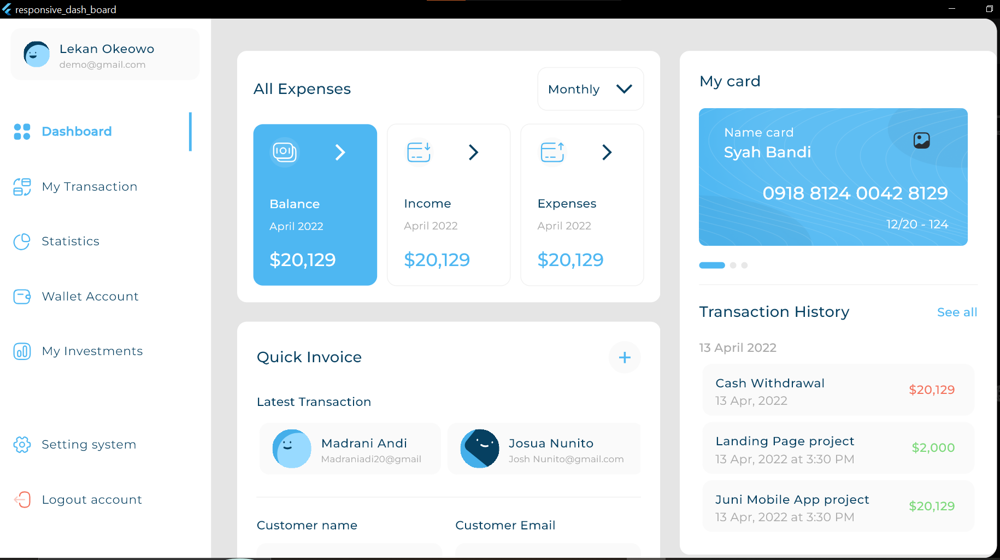
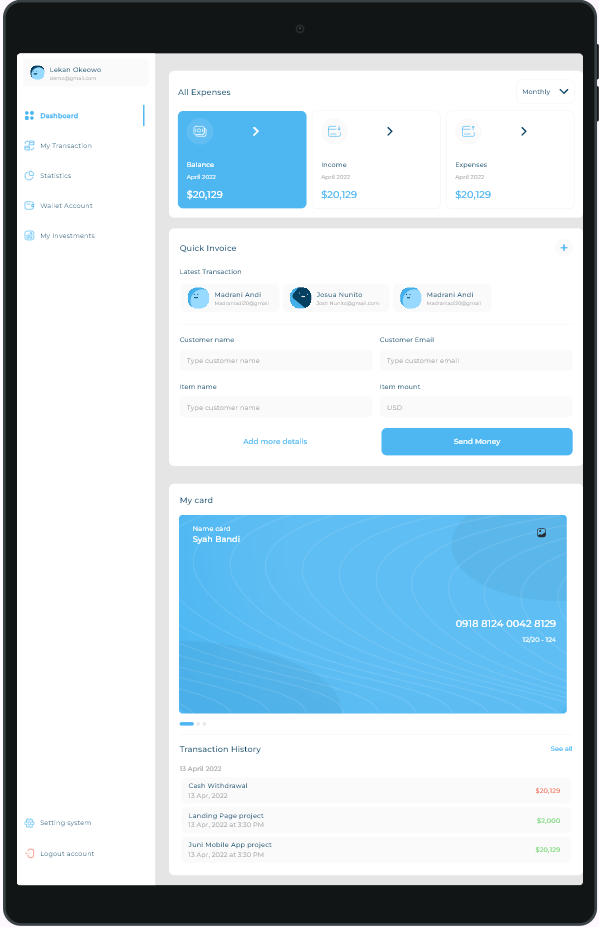
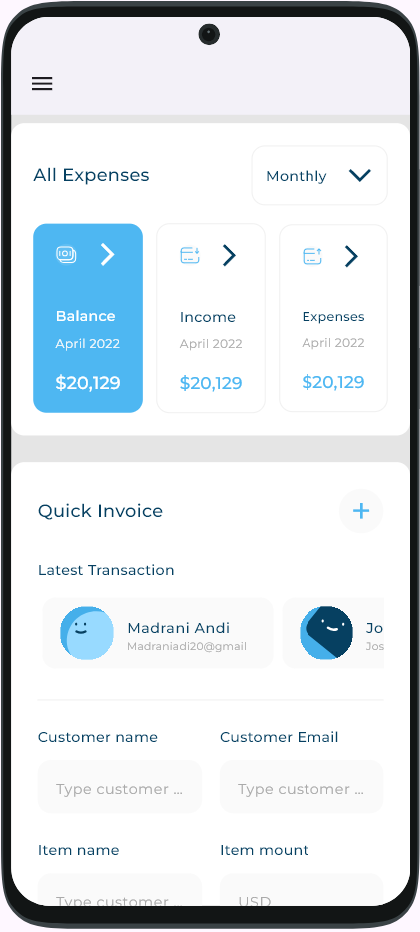

# Responsive Dash Board

A responsive dashboard application built with Flutter. It displays various financial information like expenses, income, transactions, and investments in a visually appealing and organized manner. The dashboard is designed to adapt to different screen sizes (mobile, tablet, and desktop).

## Features

*   **Responsive Layout:** Adapts to mobile, tablet, and desktop screen sizes for an optimal user experience.
*   **Dashboard Overview:** A comprehensive dashboard that includes:
    *   All expenses and quick invoice sections.
    *   My cards and latest transaction details.
    *   A visual representation of income using charts.
*   **Customizable Drawer:** A navigation drawer with items for different sections of the app.
*   **Vector Graphics:** Uses SVG images for a clean and scalable UI.

## Getting Started

To get a local copy up and running, follow these simple steps.

### Prerequisites

*   Flutter SDK: [https://flutter.dev/docs/get-started/install](https://flutter.dev/docs/get-started/install)

### Installation

1.  Clone the repo
    ```sh
    git clone https://github.com/Ahmed-Mamdouh-Elattar/responsive_dash_board.git
    ```
2.  Install packages
    ```sh
    flutter pub get
    ```
3.  Run the app
    ```sh
    flutter run
    ```

## Dependencies

*   [flutter_svg](https://pub.dev/packages/flutter_svg): For rendering SVG files.
*   [expandable_page_view](https://pub.dev/packages/expandable_page_view): For creating expandable page views.
*   [fl_chart](https://pub.dev/packages/fl_chart): For creating charts.
*   [device_preview](https://pub.dev/packages/device_preview): For previewing the app on different devices.

## Screenshots

Here are some screenshots of the application on different screen sizes:

### Desktop


### Tablet


### Mobile

